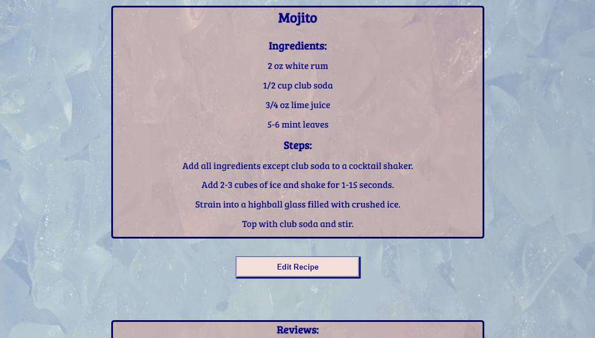

# The Cocktail Cookbook
Link to live app: https://cocktail-cookbook.jrb5004.now.sh/addrecipe

## Screenshots

### Homepage:

### Results page:

## App Summary
An app for professional mixologists/bartenders and at-home entertainers to access a database of cocktail rescipes organized by category, add new recipes to the collection, and edit/improve existing recipes.

## Technologies Used
JavaScript/React/CSS/Node.js/PostreSQL  (This repository is for the front end Javascript/React application and associted style sheets.  Please see my 'cocktail-cookbook-api' repository for the server files.

